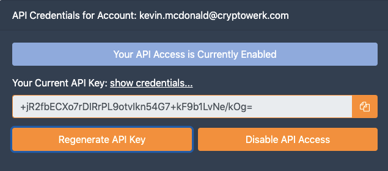

## Where do I get my API key and Credentials?
To access your API key and Credentials simply log-in to the **App Console** and go to ***Account*** info in the App Console.
If you do not have an account with Cryptowerk yet, you can sign-up via our [website](https://www.cryptowerk.com).

## How can I reset my API key?
Go to the ***Account*** section in the App Console, click "Regenerate API Key".


```
 
```
