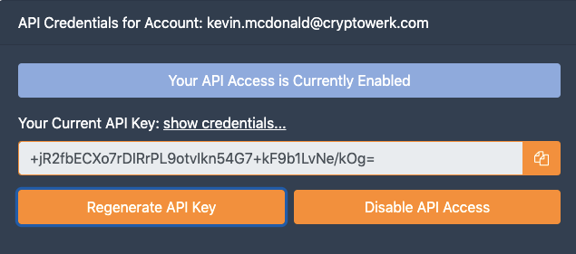

## Overview
Cryptowerk Horizon API writes hashes of data into the Bitcoin and Ethereum blockchain by default. Hashes will be submitted in the `/register` call and the result contains a unique retrieval-ID. Cryptowerk bundles the collected
hashes and creates a single super-hash. This super-hash is then anchored into the blockchains of your choice. After the super-hash has been anchored in one or more blockchains, the retrieval-ID may be exchanged for a Seal. A Seal contains the information necessary to prove that a hash was written to a blockchain.

The flows supported by this API are:

Hash  -->  retrieval-ID  -->  Seal

### What you will need
 - Cryptowerk Horizon API credentials
 - Terminal or Command Prompt access

## Getting Started
### API Key and Credentials
Sign-up or Login via the [Cryptowerk website](https://cryptowerk.com)

Select the **Account menu** and locate the API Key and Secret Credential. Save these two values with a ***space*** in between them. You can only view the credentials once.

 

The API Key is visible and can always be looked up in your **Account** info in the **App Console**. Your API Credential is secret and may only be accessed once.

## Hash the Data
A cryptographic hash is like a fingerprint. It is a mathematical algorithm that takes data of any size turns it into a unique fixed size string of values. Cryptowerk uses these so called hashes to create **Seals** for digital assets.
Open a command line terminal

```
echo -n "simple text" | shasum -a 256
```
Create a Hash:
```
2609c7c28788898a337c063ff1c3b92275832bddeda014a790d109fad3ba85e2
```
You most likely want to hash a document. To hash a document/file try this:
```
openssl dgst -sha256 <filename>
```
## Call Register API with Hashes
Using the values from step 1 and 2 open a terminal and enter
```
curl -sS \
--header "X-ApiKey: +jR2fbECXo7rDIRrPL9otvIkn54G7+kF9b1LvNe/kOg= wZ2vV5kYfDGEFsyXVZwSHBjN1TfzQovZE340hnsCRWk=" \
--data "hashes=2609c7c28788898a337c063ff1c3b92275832bddeda014a790d109fad3ba85e2" \
https://developers.cryptowerk.com/platform/API/v8/register
```
The retrieval-ID for each hash can be found in the response JSON of a successful `/register` call.
```
{
  "maxSupportedAPIVersion":8,
  "documents":[
    {"retrievalId":"ri316701018e4bc53ba7df55e0349900c6e34584202be528a0dccf8cd9d718fc23b"}
    ],
  "minSupportedAPIVersion":1
}
```
There are several approaches to retrieve the Seal but here we will focus on the simplest.

## Polling for Seal
Call `/getseal` and provide the retrieval-ID(s) then check for the return value.

```
curl -sS \
--header "X-ApiKey: +jR2fbECXo7rDIRrPL9otvIkn54G7+kF9b1LvNe/kOg= wZ2vV5kYfDGEFsyXVZwSHBjN1TfzQovZE340hnsCRWk=" \
--data "retrievalId=ri316701018e4bc53ba7df55e0349900c6e34584202be528a0dccf8cd9d718fc23b" \
https://developers.cryptowerk.com/platform/API/v8/getseal
```
For each retrieval-ID (i.e. each hash) a Seal is returned in the response JSON of a successful `/getseal` call. A Seal contains several Proofs. A Proof is a set of instructions for calculating and locating the anchor-hash that was  written as a transaction in a block of a blockchain. There is a Proof for each blockchain that gets written to. A Seal may contain several Proofs depending on the number of blockchains you are writing to and the exact timing of each confirmation.
The Seal, with two Proofs will look as follows: 
```
{
  "maxSupportedAPIVersion": 8,
  "documents": [
    {
      "retrievalId": "ri316701018e4bc53ba7df55e0349900c6e34584202be528a0dccf8cd9d718fc23b",
      "seal": {
        "documentInfo": {
          "submittedAt": 1603323008105
        },
        "proofs": [
          {
            "bundleMethod": "BALANCED_MERKLE_TREE",
            "operations": [
              {
                "blockChainId": "0xfcad1fa0c355545facec93c9767026fdd2f58eef04f6448a190def986d0d54e9",
                "instanceName": "4",
                "insertedIntoBlockchainAt": 1603323061947,
                "opcode": "BLOCKCHAIN",
                "blockchainGeneralName": "Ethereum"
              },
              {
                "docHash": "1b4f0e9851971998e732078544c96b36c3d01cedf7caa332359d6f1d83567014",
                "opcode": "DOC_SHA256"
              },
              {
                "opcode": "PREPEND_THEN_SHA256",
                "hash": "e05032bfd7311200cc18a467498409fc42a1080204d3363a8102c74a1b1a5462"
              },
              {
                "opcode": "ANCHOR_SHA256",
                "hash": "c73ffc4707f9c578d5b6ce9310a562acf5294509158702967d76549f608c721e"
              }
            ]
          },
          {
            "bundleMethod": "BALANCED_MERKLE_TREE",
            "operations": [
              {
                "blockChainId": "2c6bf1766cc19ac3c2760fe54a512016632a52b705bacaefdfb523a09502600b",
                "instanceName": "test",
                "insertedIntoBlockchainAt": 1603323481889,
                "opcode": "BLOCKCHAIN",
                "blockchainGeneralName": "Bitcoin"
              },
              {
                "docHash": "1b4f0e9851971998e732078544c96b36c3d01cedf7caa332359d6f1d83567014",
                "opcode": "DOC_SHA256"
              },
              {
                "opcode": "APPEND_THEN_SHA256",
                "hash": "2221111111111111111111111111111111111111111111111111111111111111"
              },
              {
                "opcode": "APPEND_THEN_SHA256",
                "hash": "c2c4078885cdd970b3b04e665018d3ed066484f45c779f008f2b962c0b3d38d7"
              },
              {
                "opcode": "PREPEND_THEN_SHA256",
                "hash": "7cd4000d4185ec2cd45308e79ef00bd4a5d6ebdec7f5e68e31656bdb38e3b120"
              },
              {
                "opcode": "APPEND_THEN_SHA256",
                "hash": "ed348f0bf378f938b46c583369b1d3f77cb296fceb39993454b4b8ff5b8320b3"
              },
              {
                "opcode": "ANCHOR_SHA256",
                "hash": "50ee00328ea293f7dd679949eea694a2f30efd67d82fe102ab5b13960a98b25c"
              }
            ]
          }
        ],
        "version": 8,
        "isComplete": true
      }
```
The above Seal contains one Proof for the Ethereum blockchain and one Proof for the Bitcoin blockchain.
In the JSON response of `/getseal` you will receive further information about the blockchain registrations. The information looks as follows: 

```
"submittedAt": 1603323008105,
      "hasBeenInsertedIntoAtLeastOneBlockchain": true,
      "blockchainRegistrations": [
        {
          "blockChainId": "0xfcad1fa0c355545facec93c9767026fdd2f58eef04f6448a190def986d0d54e9",
          "insertedIntoBlockchainAt": 1603323061947,
          "blockChainDesc": {
            "instanceName": "4",
            "generalName": "Ethereum"
          },
          "bcExplorerUrls": [
            "http://rinkeby.etherscan.io/tx/0xfcad1fa0c355545facec93c9767026fdd2f58eef04f6448a190def986d0d54e9"
          ],
          "status": {
            "atLeastThisNumberOfConfirmations": 26746,
            "isConsideredFinal": true,
            "anchorHash": "535701c73ffc4707f9c578d5b6ce9310a562acf5294509158702967d76549f608c721e"
          }
        },
        {
          "blockChainId": "2c6bf1766cc19ac3c2760fe54a512016632a52b705bacaefdfb523a09502600b",
          "insertedIntoBlockchainAt": 1603323481889,
          "blockChainDesc": {
            "instanceName": "test",
            "generalName": "Bitcoin"
          },
          "bcExplorerUrls": [
            "https://www.blockchain.com/btc-testnet/tx/2c6bf1766cc19ac3c2760fe54a512016632a52b705bacaefdfb523a09502600b",
            "https://live.blockcypher.com/btc-testnet/tx/2c6bf1766cc19ac3c2760fe54a512016632a52b705bacaefdfb523a09502600b",
            "https://blockstream.info/testnet/tx/2c6bf1766cc19ac3c2760fe54a512016632a52b705bacaefdfb523a09502600b"
          ],
          "status": {
            "atLeastThisNumberOfConfirmations": 902,
            "isConsideredFinal": true,
            "anchorHash": "53570150ee00328ea293f7dd679949eea694a2f30efd67d82fe102ab5b13960a98b25c"
          }
        }
      ],
      "hasBeenInsertedIntoAllRequestedBlockchains": true
    }
  ],
  "minSupportedAPIVersion": 1
}
```

Details will be explained in the following tutorials.
