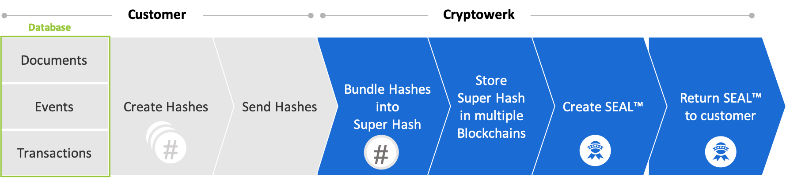

In this tutorial we will call `/register` and receive a Seal via a callback. The steps include:

 1. Hash the data
 2. Call `/register`
 3. Receive Seal via callback
 4. Store the Seal with the original data that was hashed

 

💔 This post is in need of a pull request. coming soon...

## Hash The Data
## Call Register API
Add lookupInfos to the call. This may be a primary key or other unique identifier of the original data that was hashed and registered.
## Receive Seal via Callbacks
## Store Seal
Using the lookupInfos field store Seals with the original data.
