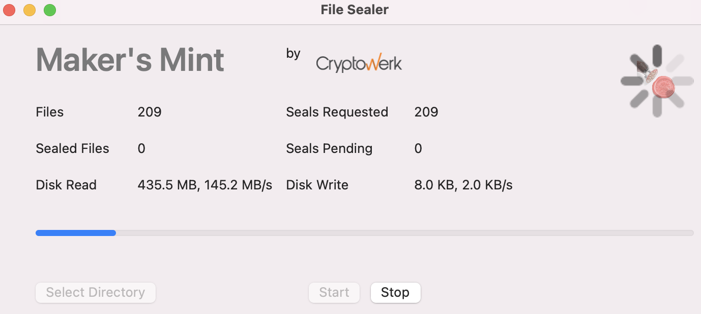
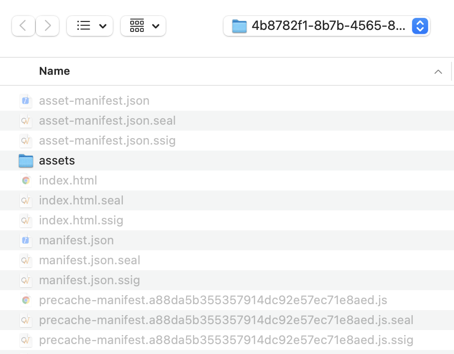
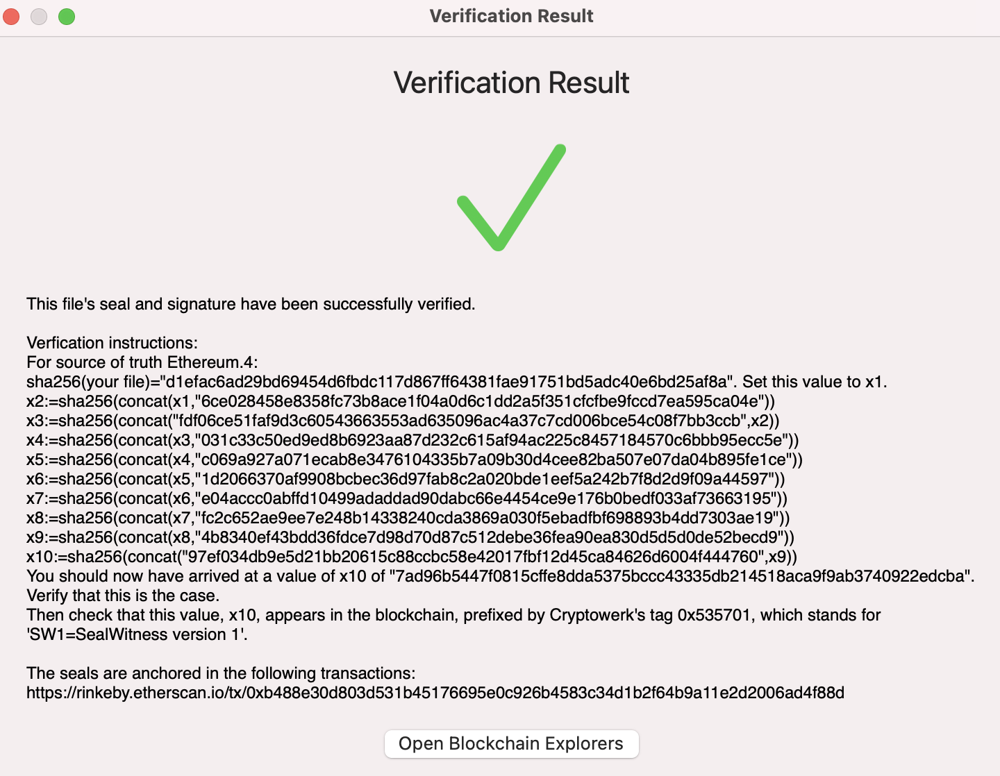
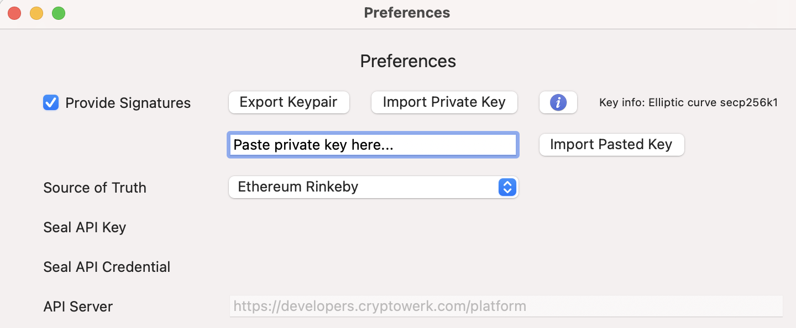

## Experimental Desktop App For Sealing and Signing Files
The following app and examples are experimental and are subject to change. This app requires an internet connection and is currently only supported on devices running MacOS. A Microsoft Windows version is being evaluated.

Maker's Mint (aka File Sealer) creates a mathematical proof for every file in a directory. This proof is called a "Seal." The Seal links your file to one or multiple sources of truth. A blockchain is one example of such a source of truth. You can use this Seal to demonstrate to any third party that your file existed at a certain time and that it remained unchanged, i.e. noone tampered with it. You can even do that without revealing your actual file by distributing only the Seal, without the file. 

In addition to a Seal, files may optionally be signed with an electronic signature. You can use the signature to prove that you were the author of the file or that you have seen it. The signature of "yourfile" is stored in "yourfile.ssig".

In the free version, you can choose between several sources of truth. If in addition, you'd like to employ more costly sources like Bitcoin Mainnet or Ethereum Mainnet, contact us at cryptowerk.com .

## Download
[macOS version](http://download.cryptowerk.net/downloads/filesealer/FileSealer.pkg)

## Select Directory In File System 
Every file in the directory you select, and its children directories, will be sealed and optionally signed. This means every file will get a companion file ending in .seal and .ssig next to it.



## Hashing, Signing, and Sealing
Once a directory folder is selected Maker's Mint will scan the directory for files and then hash them automatically. Those hashes will be used in creating digital signatures and Seals. A progress bar will will indicate how many files were present and how many of those file have Seals Requested. Another way to think about Seals Requested is how many hashes were `/registered`. The end user does not need to know or care about the underlying API methods.

The app will check to see if any of the Seals Requested have been completely processed. This may take 15-30 seconds between each check. If a Seal has not yet finalized into a blockchain the Seal Pending count is updated and the app will continue to poll for completed Seals every 15-30 seconds. If you are impatient you may hit the Start button and initiate the polling manually. When a Seal has been created the Sealed Files count will increase and the Seals Pending count will decrease until all the files have Seals.

You will notice each original file now has an accompanying .seal and .ssig file of the same name. e.g. The Seal for "yourfile" is a file named "yourfile.seal".



## Verifying Signatures and Seals
To verify a file, signature or Seal simply drag and drop the file onto the app and Maker's Mint will look for the necessary data to complete the verification process. If a file has been changed it will not verify properly and you will receive a warning. 



## Keypairs for Signing
To digitally sign a file you will need a so-called Keypair. The Keypair consists of a Public Key and a Private Key. If you don't have a Keypair, the app will create a pair for you. Simply check the box `Provide Signatures` and you are all set. 



### Using Ethereum Private Key
If you are using an Ethereum crypto wallet like MetaMask you might want to use your wallet key also for signing. In that case copy your private key from your wallet. This is typically found in `account details->Export Private Key`. Paste that value into the `Paste private key here...` box and press the import pasted key button. This is a 64 charter alphanumeric base64 encoded string.
We do NOT recommend to use you wallet key also for signing. It's generally better (and safer) to keep them separate. However, there are some corner cases where this functionality may come in handy.

If you are importing a key from another source, Maker's Mint supports both Elliptic curves secp256k1 (same as Bitcoin and Ethereum) and X9_62_prime256v1 (ANSI). You may either paste the private key as text (like the Ethereum Metamask example above) or import the private key as a .DER file.

Exporting your Keypair from the app is easy. When the `Export Keypair` button is pressed three files will be stored in the selected directory: 
 - MakersMint.signaturekey.private.der
 - MakersMint.signaturekey.public.der
 - MakersMint.signaturekey.public.pem 

You must keep the private file to yourself, and only yourself. It's like a password. Someone else could do things in your name with it. The public key file can be distributed to anyone. It is used to verify a signature, not to create one. These files use the DER and PEM standard formats. You can use the publicly freely available tool 'openssl' to examine or convert the files. Your computer usually has this tool already preinstalled but remember dropping a file onto the app will initiate the Verify process automatically. Nevertheless, you may create, manage and verify keys outside the app.

## Example OpenSSL Commands
If you would like to verify signtatures or manage your keypair you can use the 'Terminal' app with the following commands:

### Verifying a Signature:
```bash
  openssl dgst -sha256 -verify MakersMint.signaturekey.public.pem -signature yourfile.ssig <yourfile
```  
### Examine a key:
```bash
  cd thedirectorywhereyoustoredthekeys
  openssl ec -inform DER -in MakersMint.signaturekey.private.der
  openssl ec -inform DER -pubin -in MakersMint.signaturekey.public.der
```
### Converting public key from DER into PEM format:
```bash
  openssl ec -inform DER -pubin -in MakersMint.signaturekey.public.der -pubout -out MakersMint.signaturekey.public.pem
``` 
### Create a keypair:
```bash
  openssl ecparam -name secp256k1 -genkey -noout -outform DER -out newprivatekey.der
```
### Recreate public key from private key
You can also recreate the public key file from the private key file:
```  openssl ec -inform DER -in MakersMint.signaturekey.private.der -pubout -outform DER -out signaturekey.public-recreated.der
```

## Archive Seals and Signature Files
There is an option in the menu `File->Archive Seals and Signature`. This will look for files within the selected directory and add any with a .seal and .ssig extension to a zipped file called sealarchive.zip. You will find this file in the directory you selected to have it's content signed and sealed. The original data files are not archived or altered by Maker's Mint.

## Need To Start Over?
There is an option in the menu `File->Discard Seals and Signature`. If selected this will look for files within the selected directory and delete any file with a .seal and .ssig extension.

In extreme cases you may want to revert Maker Mint to its installation settings. To do so open a Terminal and run the following command:

```bash
defaults delete com.cryptowerk.sealwitness.apps-c.FileSealer
```

## This App Respects Your Privacy
Your files never leave your computer and remain known only to you. Only a fingerprint, a SHA256 cryptographic hash, is used to construct a Seal. One cannot reconstruct the file or portions of it from knowing the fingerprint. Your data remains fully confidential and is never sent to nor read by Cryptowerk.

Maker's Mint (desktop app) will however check for software updates and apply them automatically each time the app is started. 

## Moving to MainNet 
Using the app to create Seals on public blockchains will require a valid API key. The default settings use Ethereum Rinkeby, a test chain. In the menu File Sealer->Preferences you may choose to also include Bitcoin testnet or to add your Cryptowerk API Key to create Seals that are verifiable, for instance, in both blockchains' mainnet or many other sources of truth that you prefer.
